# TMS — Complete user handbook

This is the practical handbook for day-to-day work in TMS. It is intended for regular users, team members and team leads. Server installation, backups and deployment-wide integrations are covered by the separate administrator handbook.

[TOC]

## How to use this handbook

You do not need to read the handbook from beginning to end before using TMS. Choose the route that matches what you are doing now.

| If you are… | Start with | Continue with |
| --- | --- | --- |
| New to TMS | **Ten-minute quick start** | Interface map, then Practical workflows |
| Organizing personal work | Tasks, Board and Calendar in the feature reference | Workflows 1, 2, 6 and 7 |
| Leading a team or project | Projects, Teams and Discussions | Workflows 3, 4, 5 and 9 |
| Tuning your daily routine | Notifications and Saved Views | Workflows 7 and 8 |
| Looking for an exact rule | **Complete feature reference** | Everyday rules worth remembering |

The **Practical workflows** chapter is task-oriented: use it when you know what you want to accomplish but do not yet know which TMS screens are involved.

## Ten-minute quick start

1. Sign in and open **Profile settings**.
2. Verify your timezone and interface language.
3. Review personal **Statuses**; one should be the default and one should represent completion.
4. Create your first task with **New task** or global quick add.
5. Set **Planned for** when you know when you intend to work, and **Deadline** when there is a hard completion boundary.
6. View the same work in **Tasks**, **Board** and **Calendar**.
7. In **Notification settings**, enable only useful work events and transports.
8. If several tasks need shared context, create a project. If several people need it, create a team first.

> **Planned for** answers “when do I intend to work on this?”, while **Deadline** answers “when must it be finished?”. They are independent fields.

<figure>
  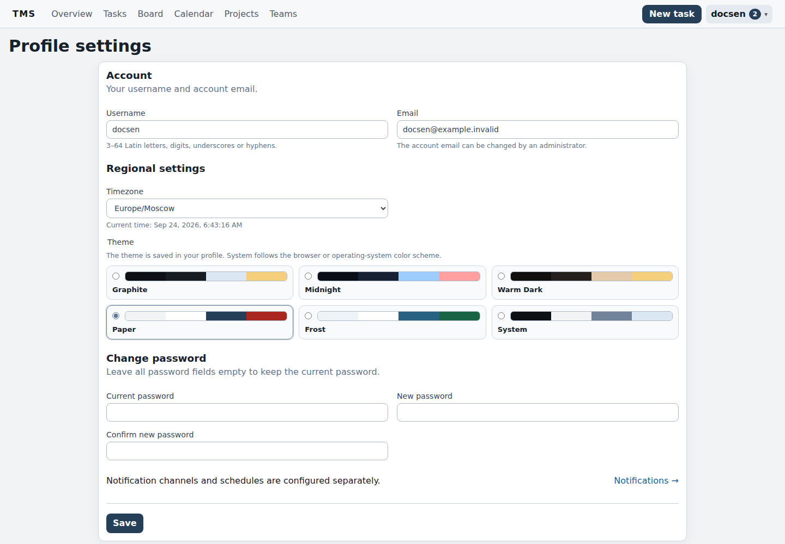
  <figcaption>Profile settings: timezone, language and personal preferences.</figcaption>
</figure>

<figure>
  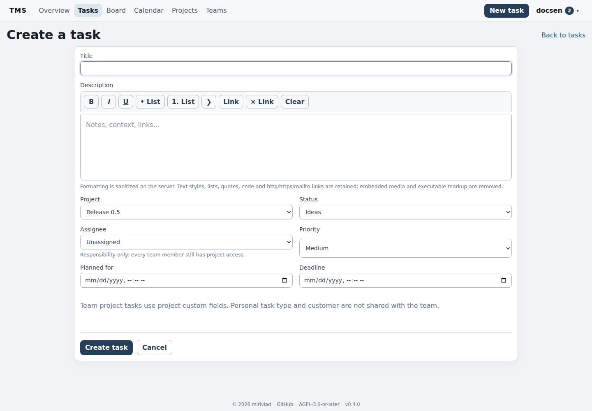
  <figcaption>New task form with project, status, assignee, priority and dates.</figcaption>
</figure>

## Interface map

| Area | Purpose |
| --- | --- |
| Dashboard | Counters, status distribution and stale work |
| Tasks | Dense list, filters, sorting, bulk actions and Saved Views |
| Board | Kanban by status |
| Calendar | Planned times, deadlines and time context |
| Projects | Shared context, workflow, fields, files, discussions and activity |
| Teams | Members, roles, invitations and team-owned projects |
| Notifications | Canonical in-app feed of work events |
| User menu | Profile, personal metadata, notifications and Projects/Teams |
| Administration | Deployment controls visible only to administrators |

<figure>
  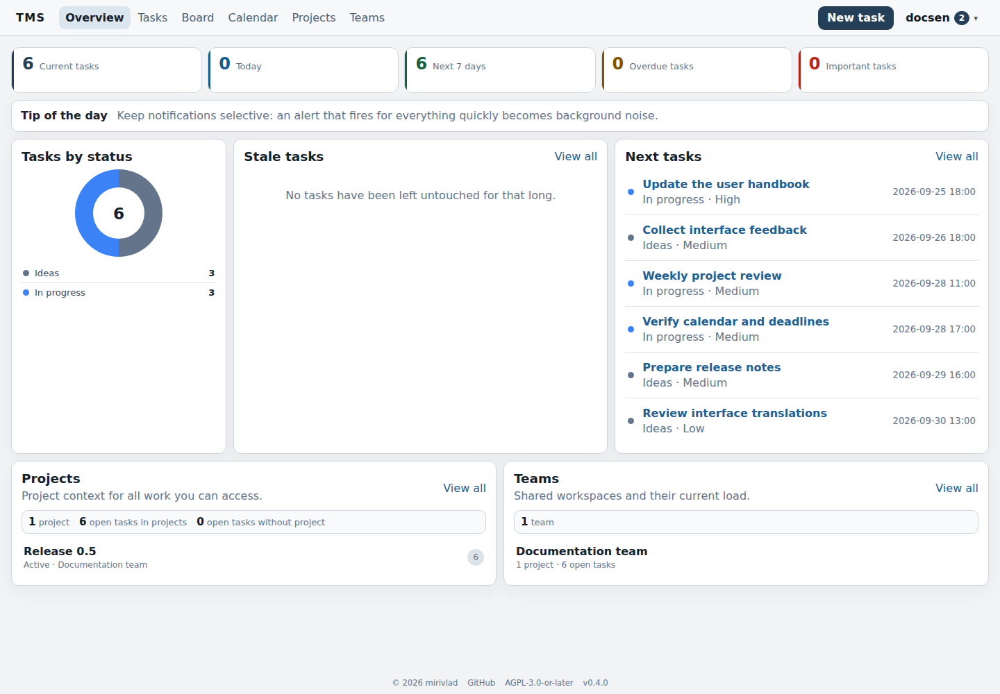
  <figcaption>TMS dashboard and primary navigation after sign-in.</figcaption>
</figure>

<figure>
  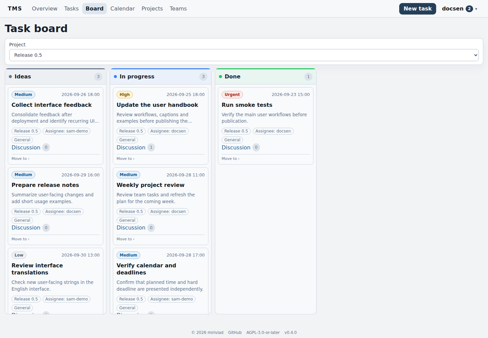
  <figcaption>Board presents the same work as a status-based Kanban.</figcaption>
</figure>

## Complete feature reference

The canonical TMS user guide is included automatically so feature documentation is maintained in one place.

{{include:../USER_GUIDE.md|shift=1|strip_nav}}

## Practical workflows

### Workflow 1. A work plan with a hard deadline

Assume a report must be sent Friday by 18:00, while you intend to work on it Thursday morning.

1. Create **Prepare weekly report**.
2. Set **Planned for** to Thursday 09:00.
3. Set **Deadline** to Friday 18:00.
4. Add priority, type and customer if useful.
5. Save the task.
6. Enable upcoming planned/deadline reminders if needed.

Moving only planned time does not change the deadline; moving only the deadline does not remove the planned work slot.

<figure>
  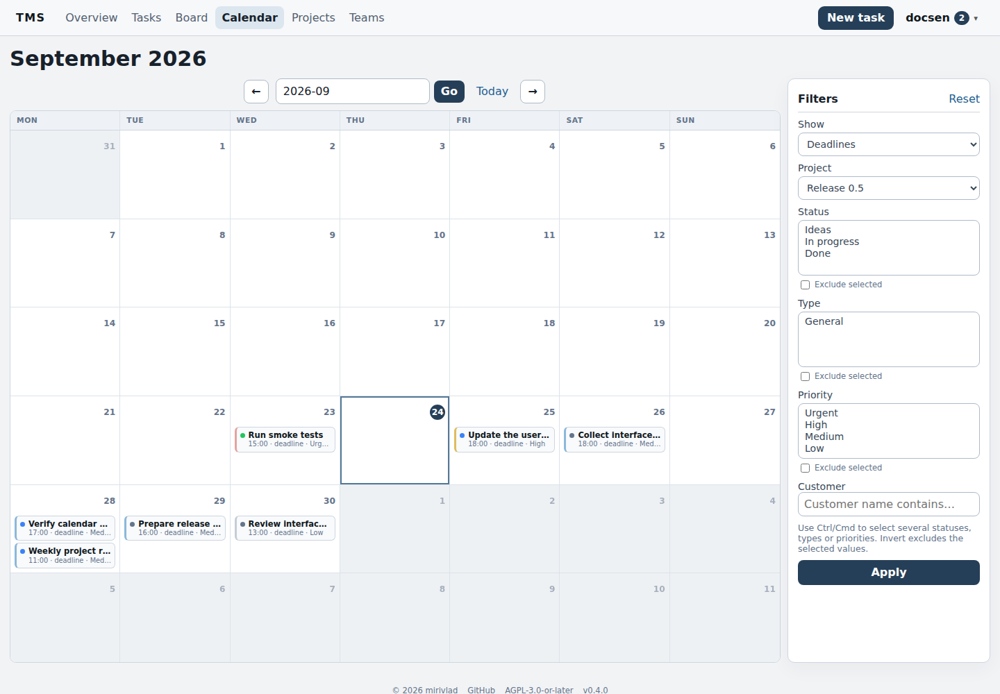
  <figcaption>Project calendar: planned work and deadlines share one time context.</figcaption>
</figure>

### Workflow 2. Process incoming personal work quickly

1. Open **Tasks → No project**.
2. Keep unfinished tasks.
3. Sort by **Planned for** or **Deadline**.
4. Open each task in quick view.
5. Change status, description, planned time or deadline directly in the dialog.
6. Save the filters as a personal Saved View if you use them repeatedly.

<figure>
  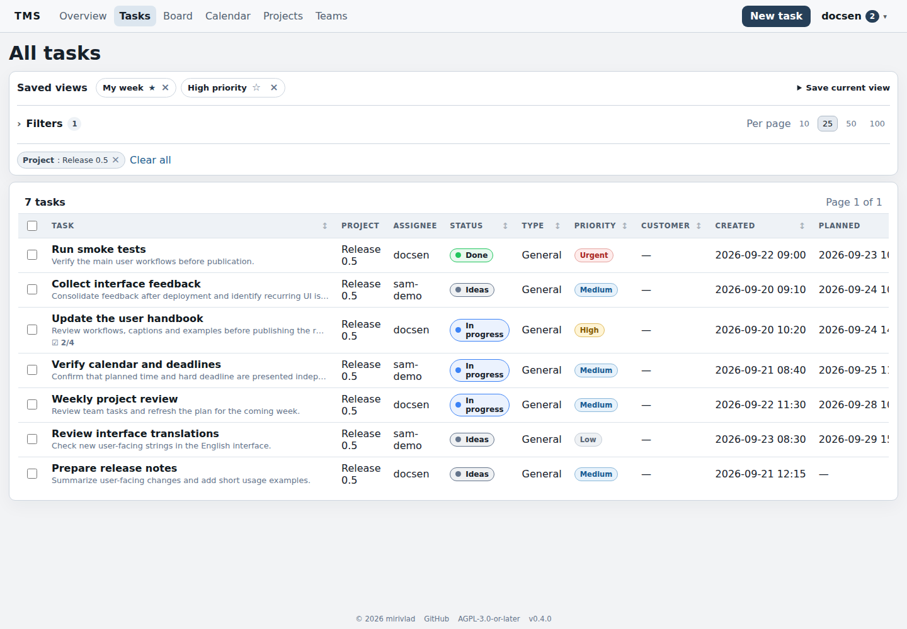
  <figcaption>Project task list with filters, Saved Views, priorities, statuses and assignees.</figcaption>
</figure>

### Workflow 3. Create a project

1. Create a project with a clear outcome description.
2. Review its project-specific task statuses.
3. Add project custom fields when structured data is needed.
4. Create tasks in the project or assign existing tasks to it.
5. Use Overview, Files, Discussion and Activity as one working context.
6. Selecting the project in the global task list switches the status filter to that project workflow.

<figure>
  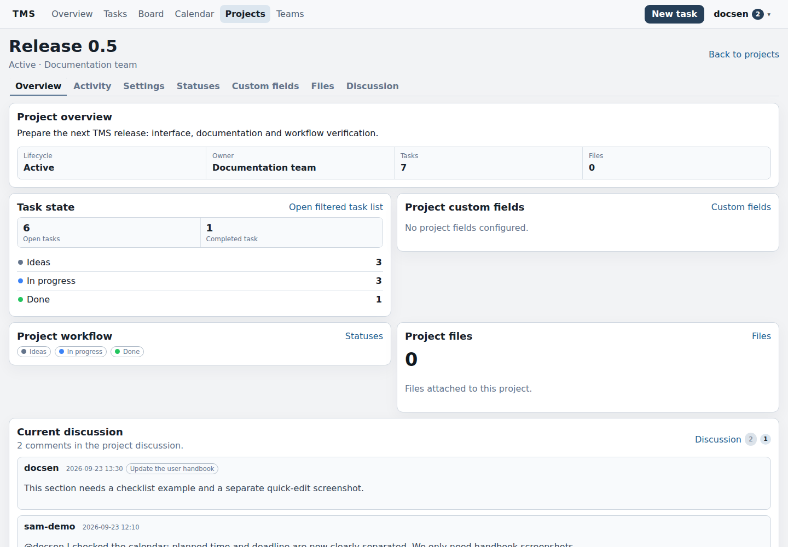
  <figcaption>Project overview combines task state, workflow, files and current discussion.</figcaption>
</figure>

### Workflow 4. Organize team work

1. Create a team; you become its first lead.
2. Invite existing TMS users.
3. After they accept, create a project owned by that team.
4. Team leads manage project workflow and membership.
5. Members work with tasks, files and discussions.
6. Assign a task to one current team member when responsibility should be explicit.

Membership grants access; **assignee** expresses responsibility only.

<figure>
  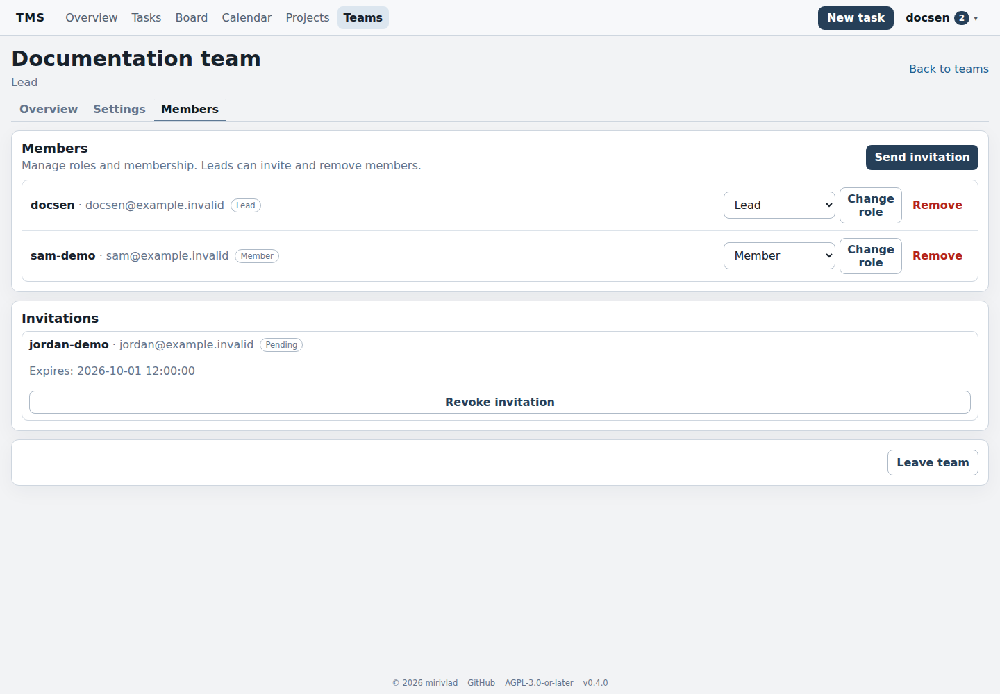
  <figcaption>Team members, roles and a pending invitation.</figcaption>
</figure>

### Workflow 5. Keep decisions next to the work

1. Open a task or project discussion.
2. Write the relevant context.
3. Use `@username` when a specific member should be notified.
4. Use reply for a response to a specific comment.
5. Record the final decision in the TMS discussion.

Email and Telegram are notification transports, not the canonical decision store.

<figure>
  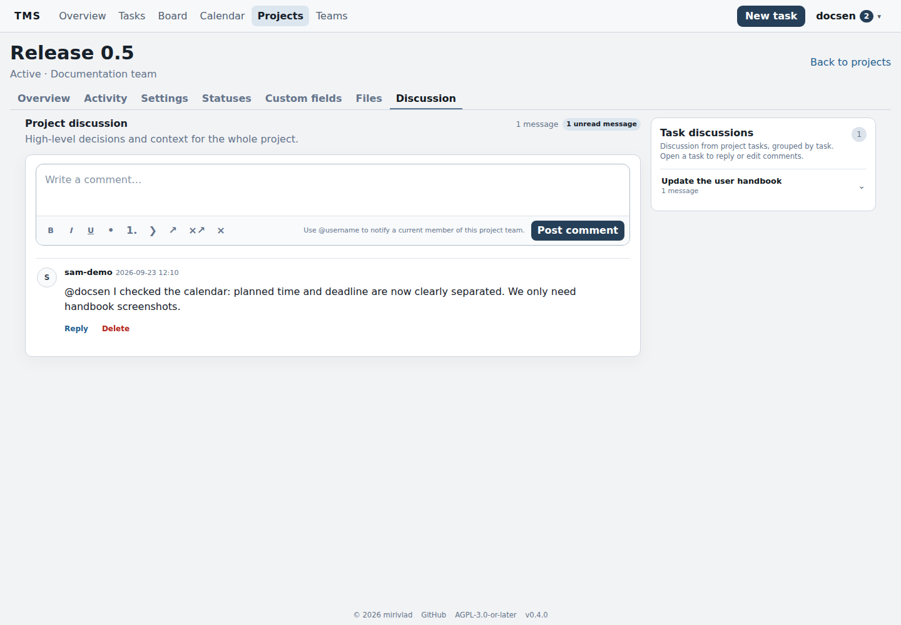
  <figcaption>Project discussion keeps working context next to the project itself.</figcaption>
</figure>

### Workflow 6. Configure a recurring task

1. Create a normal task that acts as the occurrence template.
2. Set a deadline for calendar recurrence.
3. Open edit and enable **Recurrence**.
4. Choose daily, weekly, monthly, every-N-days, or **N days after completion**.
5. After generation, verify the next occurrence's deadline, planned time, project, metadata and checklist.

Each occurrence is a separate task; previous occurrences and their history remain intact.

<figure>
  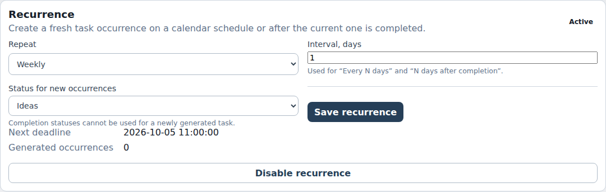
  <figcaption>Weekly recurrence configuration and the next deadline.</figcaption>
</figure>

<figure>
  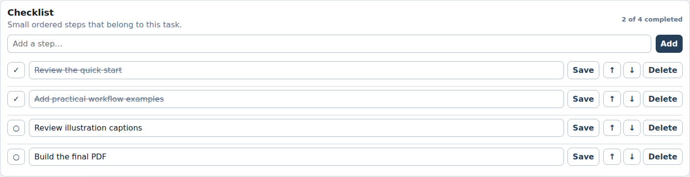
  <figcaption>Checklist inside a task with completed and remaining steps.</figcaption>
</figure>

### Workflow 7. Build a Saved View

1. Open **Tasks**.
2. Select a project or **No project**.
3. Configure statuses, types, priorities, date ranges and other filters.
4. Choose sorting.
5. Save the current state under a descriptive name such as **Today — high priority**.
6. Make it your default view when appropriate.

Ad-hoc filter changes do not silently rewrite the stored preset.

### Workflow 8. Keep notifications useful

1. Open **Notification settings**.
2. For collaboration, assignments/reassignments and planned/deadline changes are usually actionable.
3. Status changes can be noisy; enable them only when needed.
4. Configure lead times for upcoming planned times and deadlines.
5. Enable email and/or Telegram only as additional transports.
6. Send a Telegram test after linking.
7. Treat the TMS inbox as canonical history.

<figure>
  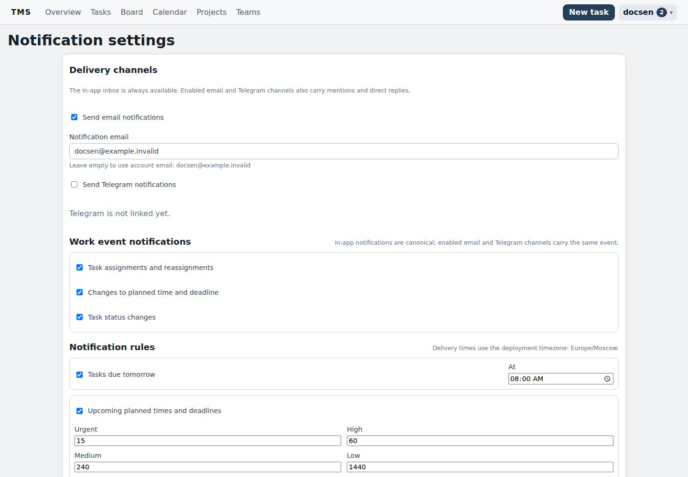
  <figcaption>User notification settings and reminder rules.</figcaption>
</figure>

<figure>
  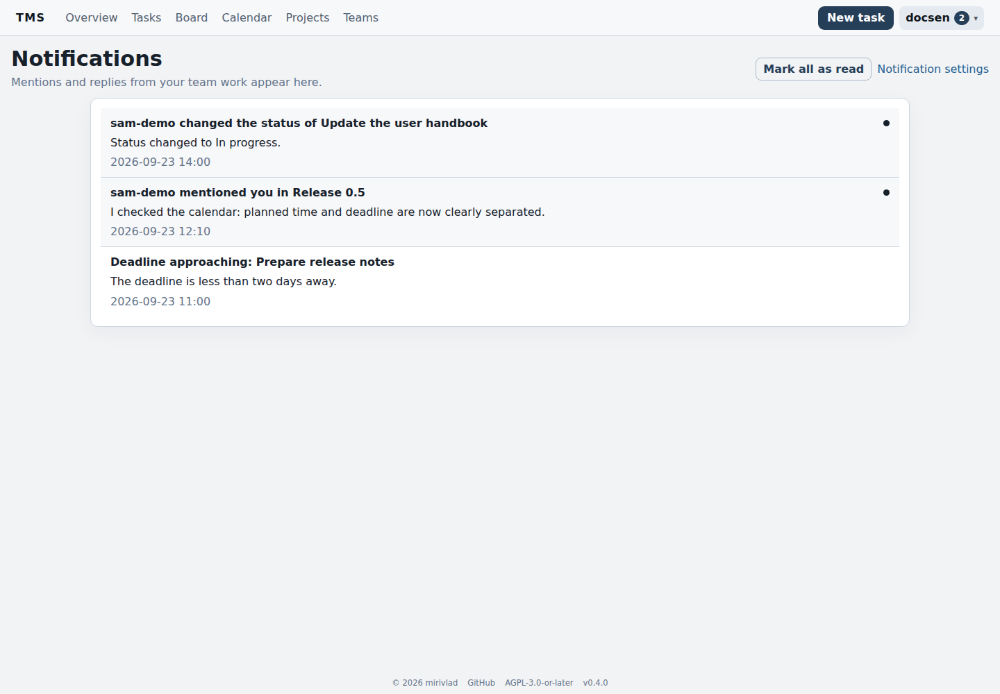
  <figcaption>TMS inbox with unread work events.</figcaption>
</figure>

### Workflow 9. Hand work to another person

1. Open a task in a team-owned project.
2. Select another current team member as assignee.
3. Save.
4. The new assignee receives a work event when that notification class is enabled.
5. Activity records the reassignment.

If the person is not yet a team member, invite them first and wait for acceptance.

<figure>
  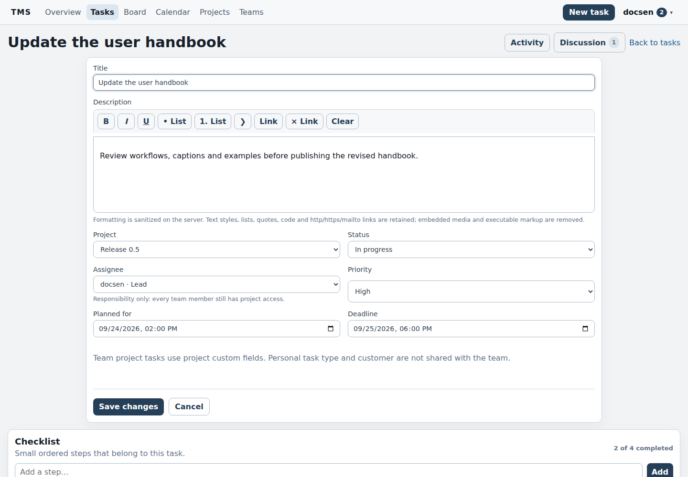
  <figcaption>Editing a team-project task: project, status, assignee, priority and dates.</figcaption>
</figure>

### Workflow 10. Recover account access

1. Click **Forgot password?** on the login page.
2. Submit the account information requested by the form.
3. Use the reset link delivered through email or linked Telegram when those transports are available.
4. After signing in, change the password and verify the profile.
5. If self-service recovery is unavailable, contact the TMS administrator; a self-hosted deployment has a local recovery path.

## Everyday rules worth remembering

- Set the correct timezone before relying on dates and reminders.
- Keep **Planned for** and **Deadline** distinct.
- Personal tasks/projects are private; team-owned projects are visible to current team members.
- **No project** uses personal statuses, a selected project uses its workflow, and the mixed status set exists only in **All projects**.
- Assignee does not control access.
- In-app notification state is canonical; email and Telegram are additional transports.
- Record decisions in the task/project discussion instead of leaving them only in an external messenger.