# TMS — Полное руководство пользователя

Это практический учебник по ежедневной работе в TMS. Он предназначен для обычного пользователя, участника команды и тимлида. Установка сервера, резервное копирование и системные интеграции вынесены в отдельное руководство администратора.

[TOC]

## Как пользоваться этим учебником

Перед началом работы с TMS не нужно читать руководство целиком. Выберите маршрут под текущую задачу.

| Если вы… | Начните с | Затем перейдите к |
| --- | --- | --- |
| Впервые открыли TMS | **Быстрый старт за десять минут** | Карта интерфейса, затем Практические сценарии |
| Организуете личную работу | Задачи, Доска и Календарь в полном справочнике | Сценарии 1, 2, 6 и 7 |
| Ведёте команду или проект | Проекты, Команды и Обсуждения | Сценарии 3, 4, 5 и 9 |
| Настраиваете ежедневный процесс | Уведомления и Saved Views | Сценарии 7 и 8 |
| Ищете точное правило поведения системы | **Полный справочник возможностей** | Что помнить при ежедневной работе |

Раздел **Практические сценарии** построен от задачи пользователя: открывайте его, когда понимаете, что хотите сделать, но ещё не знаете, через какие экраны TMS это выполняется.

## Быстрый старт за десять минут

1. Войдите в TMS и откройте **Настройки профиля**.
2. Проверьте часовой пояс и язык интерфейса.
3. Проверьте личные **Статусы**: должен быть статус по умолчанию и статус завершения.
4. Создайте первую задачу через **Новая задача** или глобальное быстрое добавление.
5. Укажите **Запланировано на**, если знаете, когда будете работать, и **Срок**, если есть крайний момент завершения.
6. Посмотрите ту же работу в **Задачах**, **Доске** и **Календаре**.
7. В **Настройках уведомлений** оставьте только полезные вам рабочие события и каналы.
8. Если задачам нужен общий контекст — создайте проект; если над ним работают несколько людей — сначала создайте команду.

> **Запланировано на** отвечает на вопрос «когда я собираюсь этим заняться?», а **Срок** — «когда это должно быть закончено?». Это независимые поля.

<figure>
  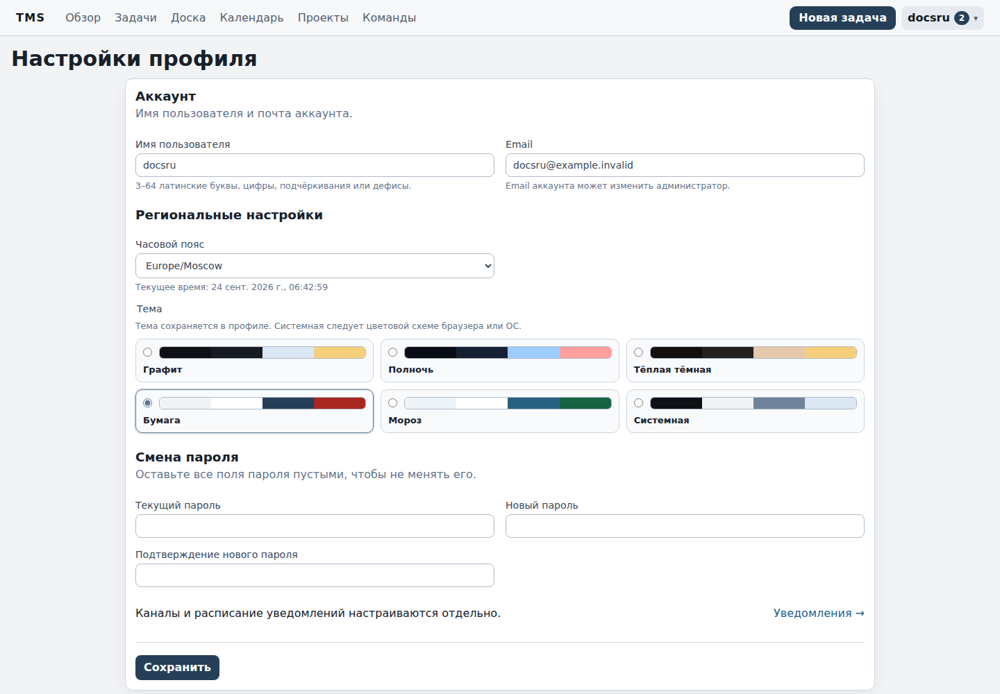
  <figcaption>Настройки профиля: часовой пояс, язык и личные параметры пользователя.</figcaption>
</figure>

<figure>
  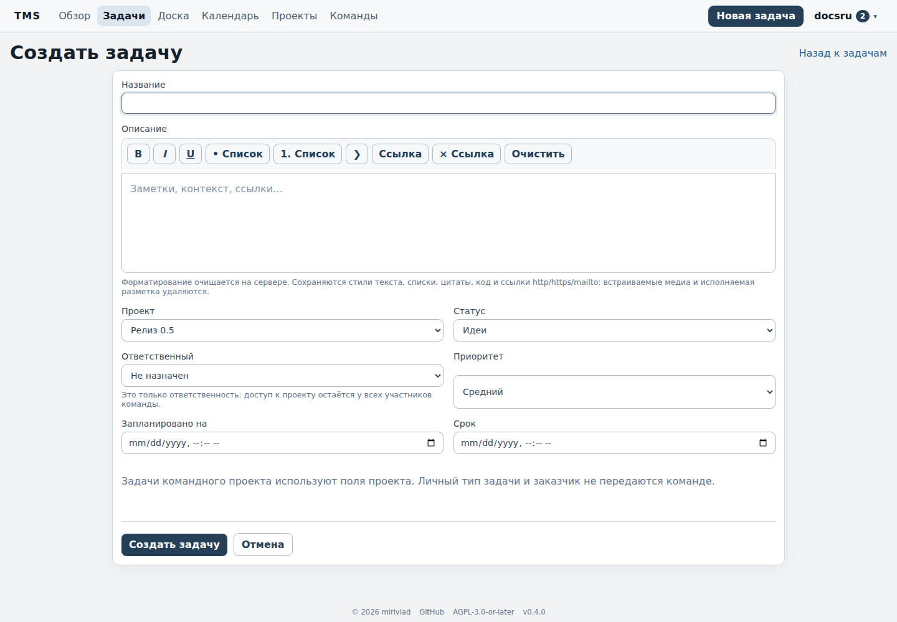
  <figcaption>Форма создания задачи с проектом, статусом, ответственным, приоритетом и датами.</figcaption>
</figure>

## Карта интерфейса

| Раздел | Для чего нужен |
| --- | --- |
| Обзор | Счётчики, распределение по статусам, залежавшиеся задачи |
| Задачи | Плотный список, фильтры, сортировка, массовые действия и Saved Views |
| Доска | Kanban по статусам |
| Календарь | Плановое время, сроки и временной контекст задач |
| Проекты | Общий контекст, workflow, поля, файлы, обсуждения и история |
| Команды | Участники, роли, приглашения и командные проекты |
| Уведомления | Каноническая внутренняя лента рабочих событий |
| Меню пользователя | Профиль, личные справочники, уведомления, Projects/Teams |
| Администрирование | Только для администраторов установки |

<figure>
  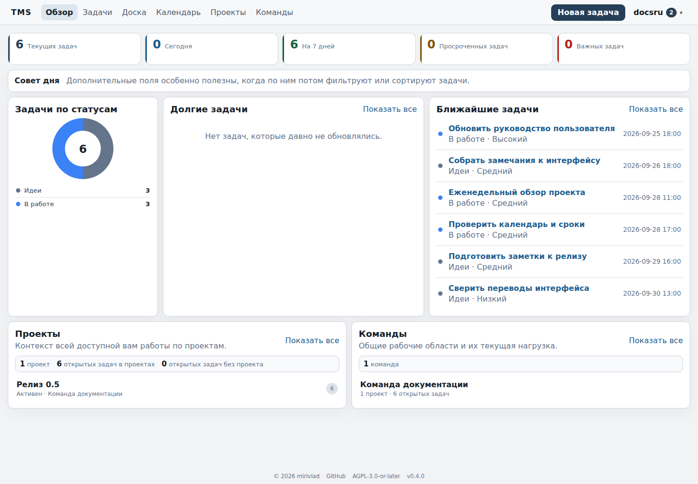
  <figcaption>Обзор TMS и основная навигация после входа.</figcaption>
</figure>

<figure>
  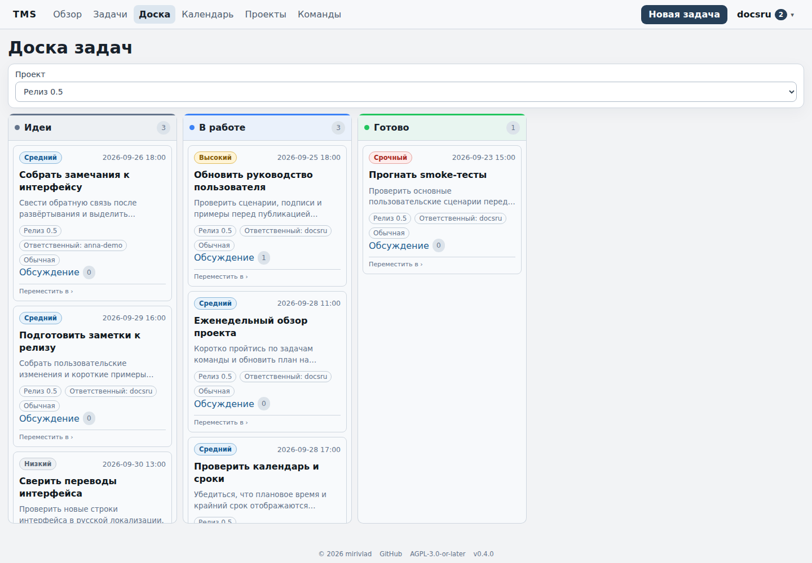
  <figcaption>Доска показывает тот же набор задач как Kanban по статусам.</figcaption>
</figure>

## Полный справочник возможностей

Следующий раздел включается из канонического руководства пользователя TMS. Поэтому изменения функций не приходится вручную копировать в два разных документа.

{{include:../USER_GUIDE.ru.md|shift=1|strip_nav}}

## Практические сценарии

### Сценарий 1. План работы и жёсткий срок

Допустим, отчёт надо отправить в пятницу до 18:00, а заняться им вы хотите в четверг утром.

1. Создайте задачу **Подготовить недельный отчёт**.
2. Поставьте **Запланировано на**: четверг 09:00.
3. Поставьте **Срок**: пятница 18:00.
4. При необходимости задайте приоритет, тип и заказчика.
5. Сохраните задачу.
6. Включите предупреждения о приближении планового времени и срока, если они нужны.

Перенос только планового времени не меняет дедлайн; перенос дедлайна не стирает рабочий слот.

<figure>
  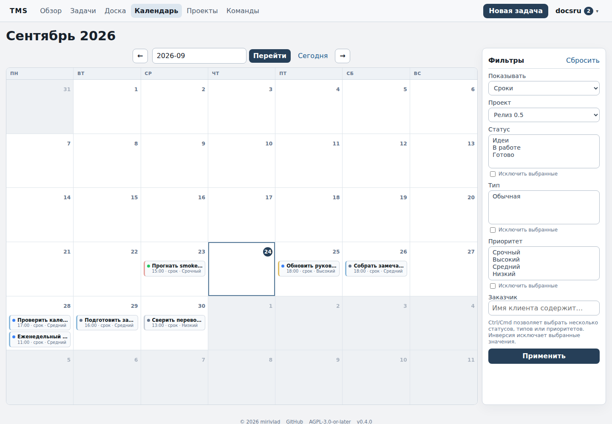
  <figcaption>Календарь проекта: плановое время и сроки показаны в одном временном контексте.</figcaption>
</figure>

### Сценарий 2. Быстро разобрать личный входящий поток

1. Откройте **Задачи → Без проекта**.
2. Оставьте незавершённые задачи.
3. Отсортируйте по **Запланировано на** или **Сроку**.
4. Открывайте задачи в быстром просмотре.
5. Меняйте статус, описание, плановое время или срок прямо в диалоге.
6. Если такой набор фильтров нужен регулярно — сохраните его как Saved View.

<figure>
  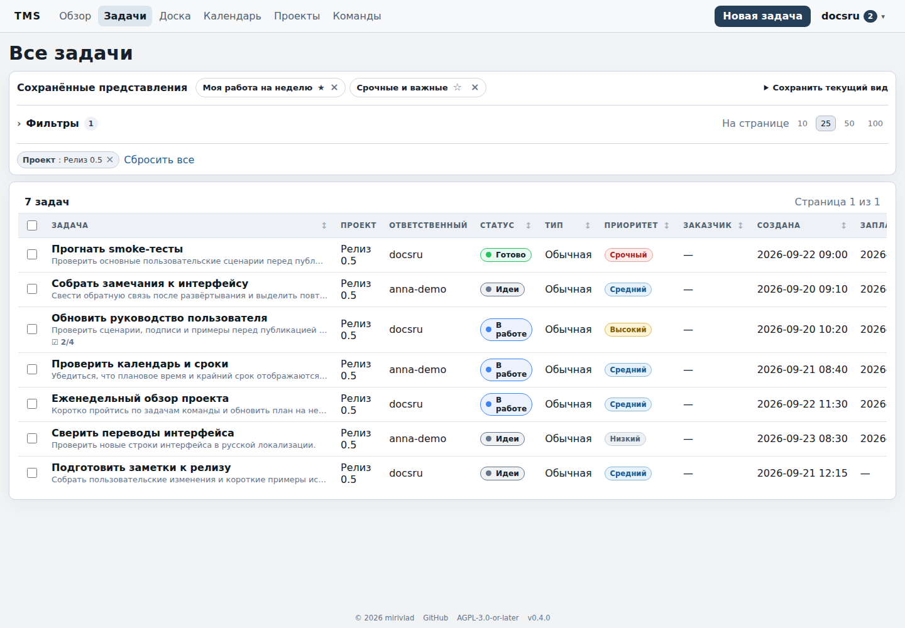
  <figcaption>Список задач проекта с фильтром, Saved Views, приоритетами, статусами и ответственными.</figcaption>
</figure>

### Сценарий 3. Создать проект

1. Создайте проект и кратко зафиксируйте ожидаемый результат.
2. Проверьте проектные статусы.
3. Добавьте пользовательские поля проекта, если нужны структурированные данные.
4. Назначьте существующие задачи проекту или создайте новые.
5. Используйте Overview, Files, Discussion и Activity как единый рабочий контекст.
6. При выборе проекта в общем списке задач фильтр статусов автоматически переключится на workflow этого проекта.

<figure>
  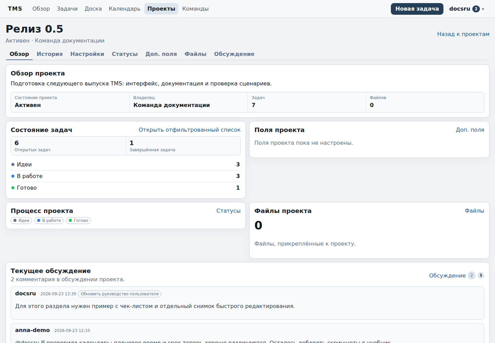
  <figcaption>Обзор проекта объединяет состояние задач, workflow, файлы и текущее обсуждение.</figcaption>
</figure>

### Сценарий 4. Организовать работу команды

1. Создайте команду — вы станете первым тимлидом.
2. Пригласите существующих пользователей TMS.
3. После принятия приглашений создайте проект с владельцем-командой.
4. Тимлиды управляют workflow проекта и составом команды.
5. Участники работают с задачами, файлами и обсуждениями.
6. Для ответственности назначайте задачу конкретному текущему участнику команды.

Членство даёт доступ, а **ответственный** лишь показывает, кто отвечает за задачу.

<figure>
  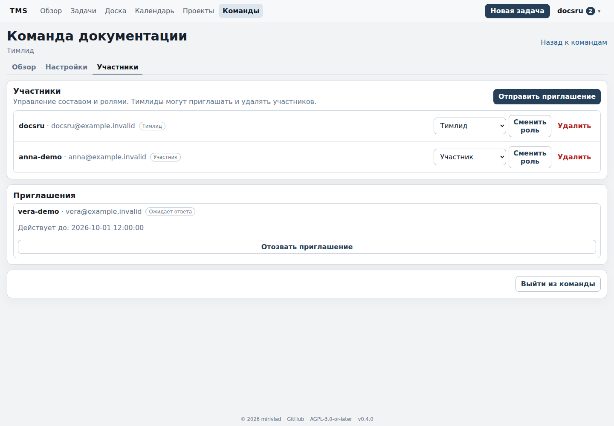
  <figcaption>Участники команды, роли и ожидающее приглашение.</figcaption>
</figure>

### Сценарий 5. Не потерять решение в мессенджере

1. Откройте обсуждение задачи или проекта.
2. Запишите необходимый контекст.
3. Используйте `@username`, если нужен конкретный участник.
4. Для ответа на конкретное сообщение используйте reply.
5. Итоговое решение оставьте в TMS рядом с рабочим объектом.

Email и Telegram — транспорт уведомлений, а не отдельное хранилище решений.

<figure>
  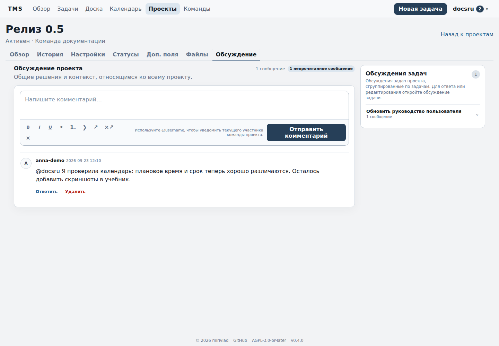
  <figcaption>Обсуждение проекта хранит рабочий контекст рядом с самим проектом.</figcaption>
</figure>

### Сценарий 6. Сделать повторяющуюся задачу

1. Создайте обычную задачу-шаблон.
2. Для календарного повторения задайте срок.
3. В редактировании включите **Повторение**.
4. Выберите ежедневный, еженедельный, ежемесячный, интервальный режим или «через N дней после выполнения».
5. Проверьте следующий экземпляр после генерации: срок, плановое время, проект, метаданные и чек-лист.

Каждый экземпляр — отдельная задача; старые экземпляры и их история не переписываются.

<figure>
  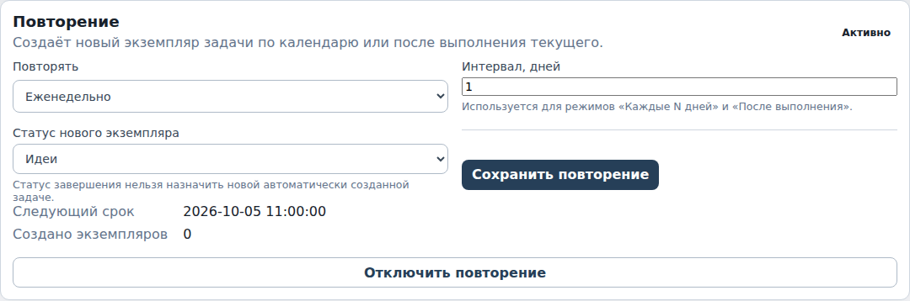
  <figcaption>Настройка еженедельного повторения и следующего срока.</figcaption>
</figure>

<figure>
  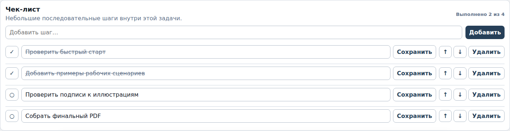
  <figcaption>Чек-лист внутри задачи: выполненные и оставшиеся шаги.</figcaption>
</figure>

### Сценарий 7. Сохранить рабочий экран

1. Откройте **Задачи**.
2. Выберите проект или **Без проекта**.
3. Настройте статусы, типы, приоритеты, даты и другие фильтры.
4. Выберите сортировку.
5. Сохраните набор под понятным именем, например **Сегодня — высокая важность**.
6. При необходимости назначьте его основным.

Ручные изменения фильтров не переписывают старый Saved View автоматически.

### Сценарий 8. Оставить только полезные уведомления

1. Откройте **Настройки уведомлений**.
2. Для командной работы обычно полезны назначения/переназначения и изменения планового времени/срока.
3. Изменения статуса могут быть шумными — включайте их только при необходимости.
4. Настройте предупреждения до планового времени и срока по приоритетам.
5. Email/Telegram используйте как дополнительные каналы.
6. После привязки Telegram отправьте тест.
7. Источником истины остаётся внутренняя лента TMS.

<figure>
  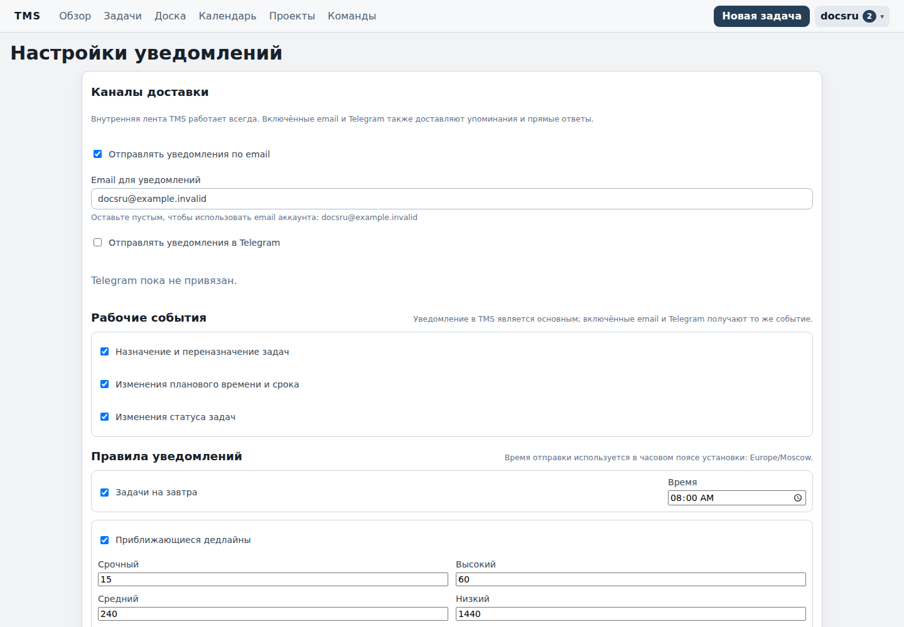
  <figcaption>Настройки пользовательских уведомлений и правил напоминаний.</figcaption>
</figure>

<figure>
  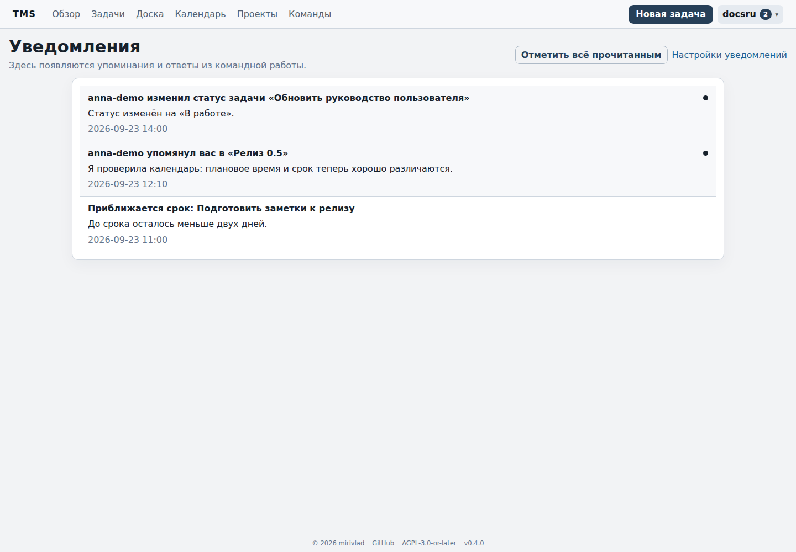
  <figcaption>Внутренняя лента TMS с непрочитанными рабочими событиями.</figcaption>
</figure>

### Сценарий 9. Передать задачу другому человеку

1. Откройте задачу командного проекта.
2. Выберите другого ответственного из текущих участников.
3. Сохраните.
4. Новый ответственный получит рабочее событие, если этот класс уведомлений включён.
5. Переназначение попадёт в Activity.

Если человека ещё нет в команде, сначала пригласите его и дождитесь принятия приглашения.

<figure>
  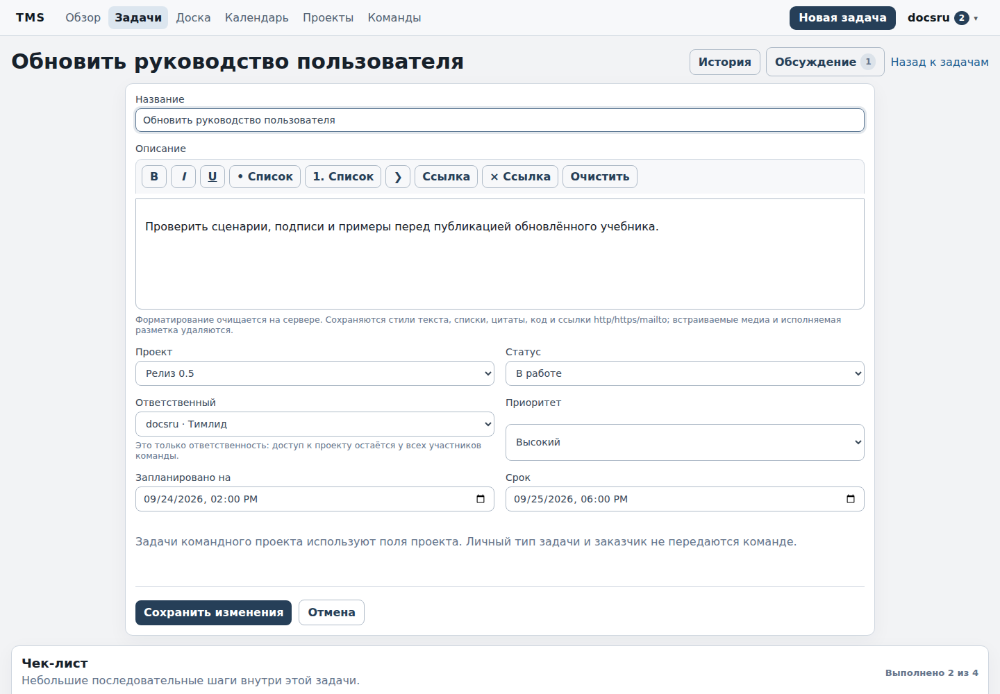
  <figcaption>Редактирование задачи командного проекта: проект, статус, ответственный, приоритет и даты.</figcaption>
</figure>

### Сценарий 10. Восстановить доступ

1. На странице входа нажмите **Забыли пароль?**
2. Заполните форму.
3. Используйте ссылку из email или привязанного Telegram, если эти транспорты настроены.
4. После входа смените пароль и проверьте профиль.
5. Если self-service недоступен, обратитесь к администратору TMS: у self-hosted установки есть локальный recovery-путь.

## Что помнить при ежедневной работе

- Сначала настройте часовой пояс, потом доверяйте датам и уведомлениям.
- Не смешивайте **Запланировано на** и **Срок**.
- Личные задачи и проекты приватны; командные проекты видны текущим участникам команды.
- В **Без проекта** используются личные статусы; выбранный проект использует свой workflow; смешанный список статусов появляется только в **Все проекты**.
- Ответственный не управляет правами доступа.
- Внутреннее уведомление TMS канонично; email и Telegram — дополнительные транспорты.
- Решения по задаче или проекту фиксируйте в соответствующем обсуждении.